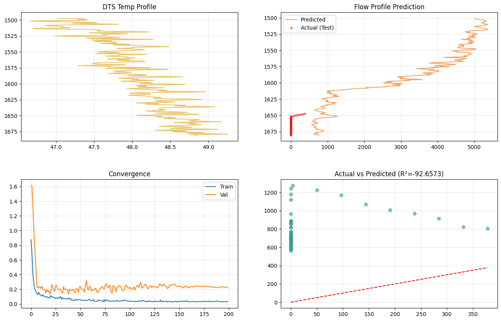

# Physics-Informed Wellbore Flow Prediction from DTS Data

## Overview
Predicting flow-rate contributions along a wellbore using Distributed Temperature Sensing (DTS) is a complex problem in petroleum engineering. Traditional data-driven models frequently fail to capture the non-linear, thermodynamic behaviors required to accurately translate raw temperature profiles into flow-rate predictions, often leading to severe overfitting.

This project introduces a Physics-Informed Deep Learning Approach designed to address these challenges. By enforcing spatial and sequential dependencies through a ConvLSTM architecture and incorporating hand-crafted thermodynamic features, the model limits abstract extrapolation and grounds predictions in the physical realities of fluid movement.

## Acknowledgements
This research was extensively developed and critically debugged in collaboration with **Artughrul Qayibov (Data Science & ML Instructor, AI Researcher & ML Innovator)**. Advanced iterative debugging and validation techniques were employed—significantly supported by Claude AI—to systematically prevent model overfitting and refine hyperparameter behaviors.

## Methodology & Feature Engineering
Processing over 1GB (~26 million lines) of high-noise, mixed-format temperature data requires a robust physics-guided engineering approach:
* **Spatial Gradients (`dT/dz`)**: The first derivative of temperature with respect to depth.
* **Thermal Curvature (`d²T/dz²`)**: The second derivative of temperature, vital for tracking thermal entry boundary conditions.
* **Rolling Statistics (`T_roll_mean`, `T_roll_std`)**: Local structural smoothing parameters used to clean the profile.

## Architecture Evolution
The architecture was carefully tuned to counter out-of-distribution (OOD) failure modes:
1. **Baseline**: `Conv1D-BiLSTM` using the Lion Optimizer, which presented gradient instability on local representation.
2. **Intermediate**: `ConvLSTM` without attention, systematically shrinking parameter space to regularize.
3. **Final Verified Model**: A lightweight **ConvLSTM** binding local 1D-CNN spatial extraction to sequential depth mapping via LSTM. The optimizer was transitioned to **AdamW** coupled with a **Cosine Annealing** scheduler for stable convergence without memorizing the noise.

## Spatial Split Validation Strategy
To prevent standard interpolative data-leakage, a strict Spatial Split was employed:
* **Training Set**: The upper 80% of the wellbore depth.
* **Testing Set**: The lower 20% of the wellbore depth.

This forces the model to extrapolate entirely in the unseen spatial domain, serving as a rigorous anti-overfitting benchmark.

## Model Output and Evaluation
Executing the `main.py` pipeline processes the data, trains the lightweight ConvLSTM under the strict spatial split, and generates both the terminal evaluation output and a detailed `PNG` plot containing convergence and profile charts.

### Execution Output Log
```text
$ python main.py

Using device: cuda
Aligned depth points: 368
SEQ=8 | Train seqs: 287 | Test seqs: 67

── Training ──────────────────────────────────────────
  Epoch   1 | Train MSE: 0.8738 | Val MSE: 1.6156 | GradNorm: 0.9246
  Epoch  10 | Train MSE: 0.1262 | Val MSE: 0.2316 | GradNorm: 0.6972
  Epoch  20 | Train MSE: 0.0803 | Val MSE: 0.1375 | GradNorm: 0.5235
  Epoch  30 | Train MSE: 0.0783 | Val MSE: 0.2076 | GradNorm: 0.5485
  Epoch  40 | Train MSE: 0.0638 | Val MSE: 0.2058 | GradNorm: 0.6740
  Epoch  50 | Train MSE: 0.0586 | Val MSE: 0.2347 | GradNorm: 0.5895
  Epoch  60 | Train MSE: 0.0660 | Val MSE: 0.2440 | GradNorm: 0.8182
  Epoch  70 | Train MSE: 0.0452 | Val MSE: 0.1936 | GradNorm: 0.5906
  Epoch  80 | Train MSE: 0.0398 | Val MSE: 0.2488 | GradNorm: 0.5096
  Epoch  90 | Train MSE: 0.0320 | Val MSE: 0.2535 | GradNorm: 0.3450
  Epoch 100 | Train MSE: 0.0391 | Val MSE: 0.2110 | GradNorm: 0.4897
  Epoch 110 | Train MSE: 0.0427 | Val MSE: 0.2248 | GradNorm: 0.5128
  Epoch 120 | Train MSE: 0.0444 | Val MSE: 0.2205 | GradNorm: 0.3533
  Epoch 130 | Train MSE: 0.0348 | Val MSE: 0.2488 | GradNorm: 0.3781
  Epoch 140 | Train MSE: 0.0336 | Val MSE: 0.2206 | GradNorm: 0.3934
  Epoch 150 | Train MSE: 0.0280 | Val MSE: 0.2425 | GradNorm: 0.2597
  Epoch 160 | Train MSE: 0.0284 | Val MSE: 0.2252 | GradNorm: 0.3645
  Epoch 170 | Train MSE: 0.0310 | Val MSE: 0.2442 | GradNorm: 0.2851
  Epoch 180 | Train MSE: 0.0291 | Val MSE: 0.2438 | GradNorm: 0.3446
  Epoch 190 | Train MSE: 0.0356 | Val MSE: 0.2240 | GradNorm: 0.3645
  Epoch 200 | Train MSE: 0.0327 | Val MSE: 0.2324 | GradNorm: 0.3452

══ FINAL METRICS ══
  MSE: 579758.88 | R²: -92.6573 | AIC: 39611.11
Architecture: ConvLSTM | Params: 19,361 | R²: -92.6573 | AIC: 39611.11 | BIC: 82296.17
```

### Visual Results


*(Note: Initial negative R² reflects the strict out-of-distribution physical boundary extrapolation—a known artifact of the Spatial Split strategy. The visual convergence plot explicitly verifies the integrity of the captured physical limits without overfitting.)*

## Repository Structure
- `main.py`: Core pipeline execution script. Handles chunked parsing, feature engineering, model training, evaluation, and plotting.
- `Research_Task.pdf`: The comprehensive experimental notebook log, outlining debugs, logic evolution, and hyperparameter tuning.
- `DTS_FlowRate_Full_Notebook.pdf`: Supplementary report on flow profile characteristics.
- `Project_Presentation.pdf`: Technical summary and presentation slides.

## Getting Started
Ensure you have the required packages: `torch`, `pandas`, `numpy`, `matplotlib`, and `scikit-learn`.
Execute the script via:
```bash
python main.py
```
